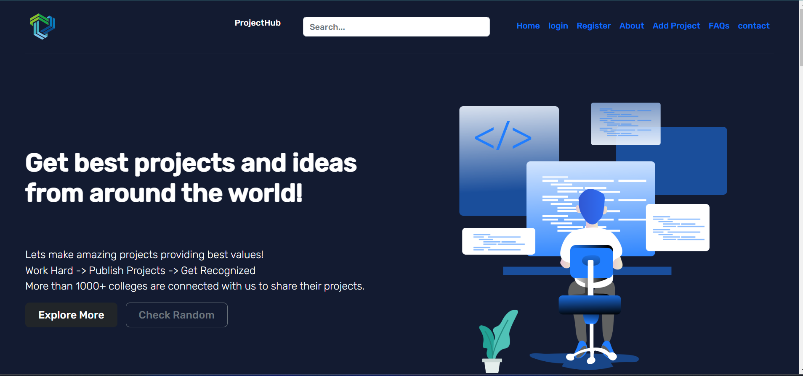
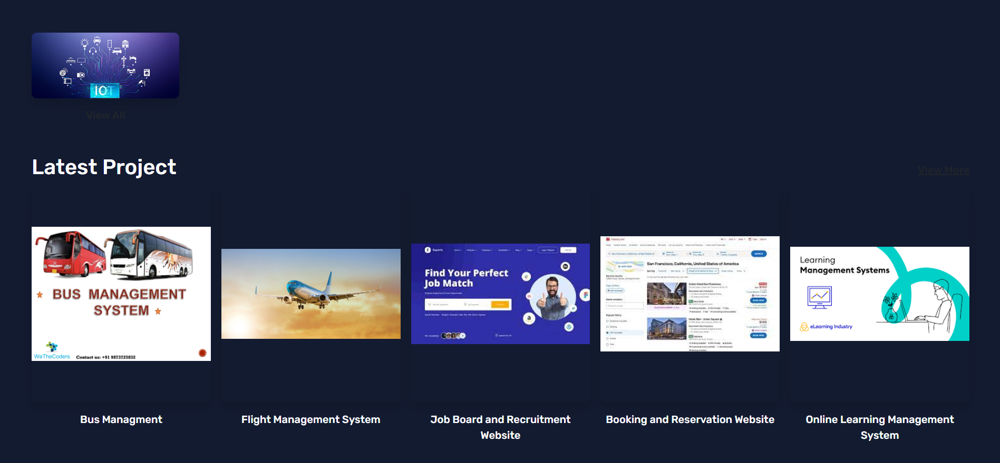
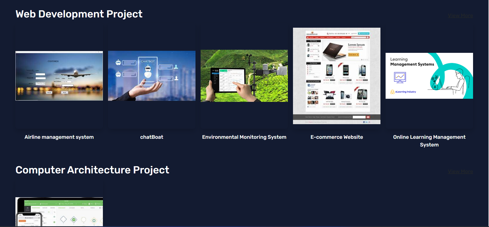
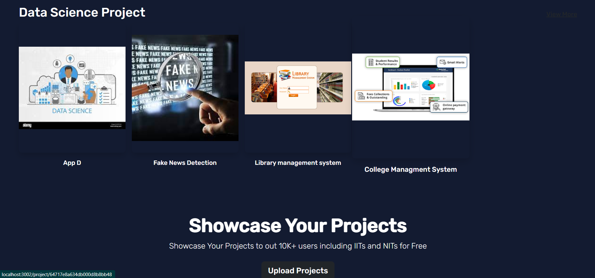
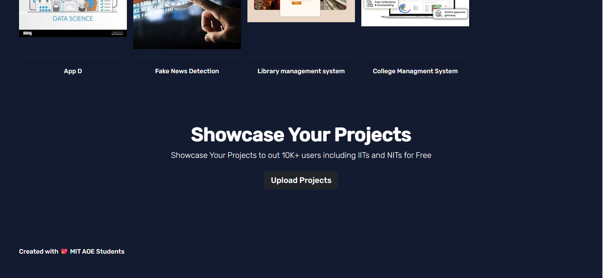
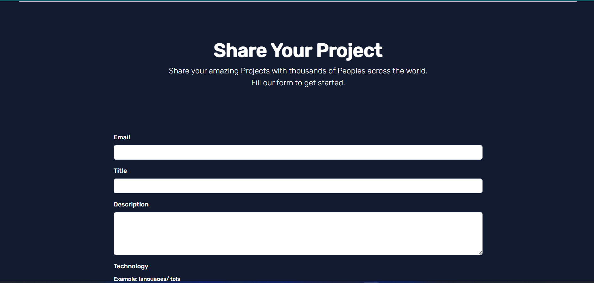
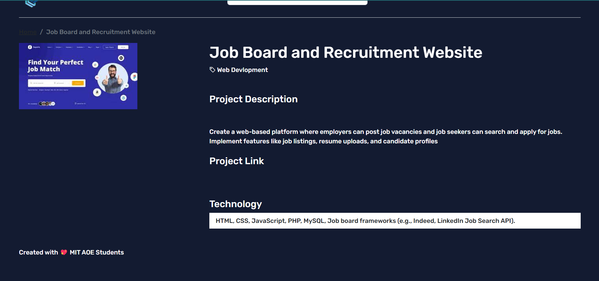

# TheProjectHub - Showcase your project

- This is a Software Engineering Hackathon Project Created By team28 
- Live Site URL: [Live site URL]()
- Video Demo : [Video Demo](#)
- Code Walkthrough : [Code Walkthrough](#)

## Table of contents

- [TheProjectHub - Showcase your project](#theprojecthub---showcase-your-project)
  - [Table of contents](#table-of-contents)
  - [Overview](#overview)
  - [My process](#my-process)
    - [What I learned](#what-i-learned)
    - [Built with](#built-with)
  - [🖥️ Tech Stack](#️-tech-stack)
    - [🚀 Features🔥](#-features)
    - [😇 Upcoming Features🔥](#-upcoming-features)
  - [Sneak Peek 🙈](#sneak-peek-)
  - [Useful resources](#useful-resources)
  - [📬 Contact](#-contact)

## Overview

## My process

- I used my knowledge of the Nodejs to build this project.
- Learned about ejs templates
- **All Links are in [Useful resources](#useful-resources).**

### What I learned

- Learned the complete NodeJs Development
- Detailed understanding of the backend and frontend
- Learned how build projects with in 12 hour timeline
- Explored ejs templates 
- Combined the frontend and backend to make a full stack application
- Had experience with Teamwork and collaborate with team members
- Learned how to deploy the app on Railway

### Built with

- Complete Nodejs and MongoDB backend
- Ejs Templates

## 🖥️ Tech Stack

**Frontend:**

&nbsp;
&nbsp;
&nbsp;

**Backend:**

&nbsp;
&nbsp;
&nbsp;
&nbsp;
&nbsp;

**Deployed On:**

### 🚀 Features🔥

- User Login and Signup
- Add Projects
- Showcase Projects
- Explore Other Projects
- **Search Any Projects Based on Technology, Category or Keywords**

### 😇 Upcoming Features🔥

- Fixing Minor Bugs
- Like and Discuss Projects
- User profile 

## Sneak Peek 🙈

<table>
  <tr>
    <td></td>
    <td></td>
  </tr>
  <tr>
    <td></td>
    <td></td>
  </tr>
  <tr>
    <td></td>
    <td></td>
  </tr>
</table>

## Useful resources

- [Complete NodeJs Developer Bootcamp 2022](https://www.example.com) - This is the Udemy Course that i followed to learn NodeJs💛.
- [Thapa Technical](https://www.example.com) - This is the Youtube Channel that i followed to learn ReactJs💙.
- Also Some Online Blogs and Articles.

## 📬 Contact

If you want to contact me, you can reach me through below handles.

© 2022 Mitesh Tank ❤

